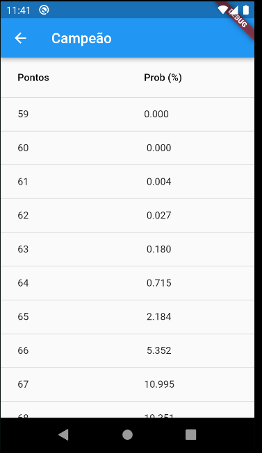

# Probabilidades Brasileirão

# Sobre

Projeto em Flutter para iniciar os estudos na tecnologia.
O objetivo é apresentar as probabilidades do futebol brasileiro para as séries A e B,
usando dados obtidos do site da UFMG:

- Séria A: https://www.mat.ufmg.br/futebol/serie-a/
- Série B: https://www.mat.ufmg.br/futebol/serie-b/

# Capturas de tela

# Próximos passos

- [ ] Criar uma splash screen
- [ ] Incrementar testes dos widgets
- [ ] Aprofundar sobre uso de layouts e tentar aplicar layouts avançados
